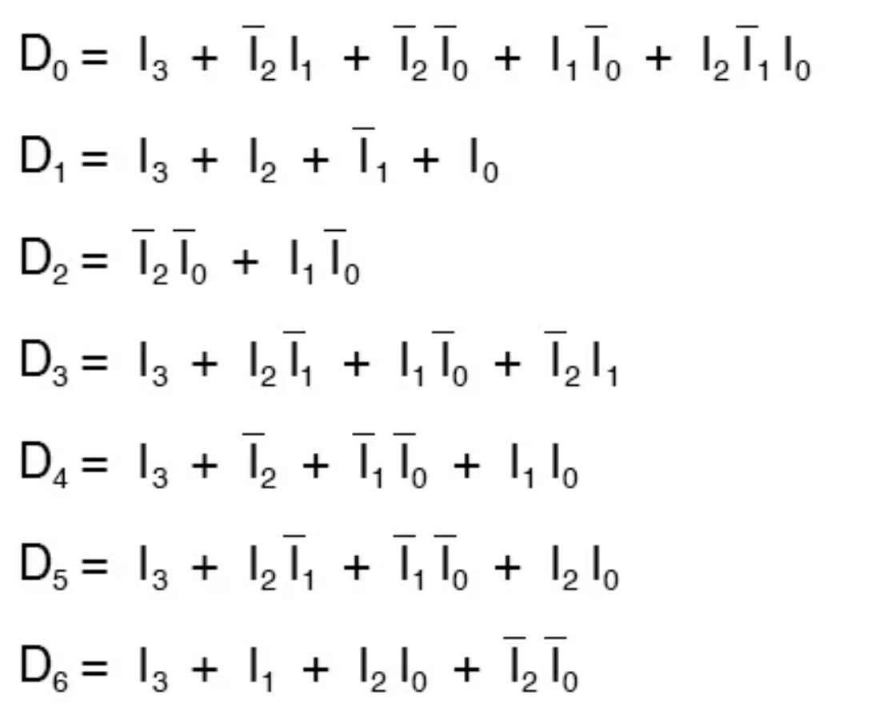

# COMP2611  Computer Organization
## **Logics** &nbsp; Review Notes

### 1. Logic Gates

### 2. Logic Universality

With those gates, we can implement **all** of the possible Boolean switching functions:

-  AND, OR, NOT
-  AND, NOT
-  OR, NOT
-  NAND
-  NOR

How to build?
- with AND, NOT

- with OR, NOT

- with NAND

- with NOR

### 3. Digital Logic

- Two types of digital logic circuits inside a computer:
  - **Combinational logic circuits**
    - Do not have **memory**
    - **Output** depends only on Inputs and Circuit
    - Can be fully specified with a **truth table** or **logic equation**
  - **Sequential logic circuits**
    - Have **memory**
    - **Output** depends on **both** inputs and value stored in memory(called **state**)

### 4. Translate Truth Table to Logic Expression

- **minterm**, denoted as $m_i$, is the **AND** of $n$ boolean variables in its original or negated form.

- **maxterm**, denoted as $M_i$, is the **OR** ...

- Any bool function can be expressed as either:

  - An **OR/sum** of its **1-minterms** (Expression is TRUE if **any** of the 1 happens)
  - An **AND/product** of its **0-maxterms** (Expression is TRUE if **all** of the 0 don't happen)

- Example: 

  

### 5. Boolean Algebra

- Basic Laws of Boolean Algebra

  

- By Absorption Law, you can **expand** an expression by adding extra items, see below examples.

- Examples 1: Simplify expressions below:

  - Q1. $C+\overline{BC}$.

    Ans: $=C+\overline{B}+\overline{C}=\overline{B}+1=1$

  - Q2. $\overline{AB}(\overline{A}+B)(\overline{B}+B)$

    Ans: $=\overline{AB}(\overline{A}+B)=(\overline{A}+\overline{B})(\overline{A}+B)=\overline{A}\cdot \overline{A}+\overline{A}B+\overline{A}\cdot \overline{B}+B\overline{B}=\overline{A}+\overline{A}(B+\overline{B})+0=\overline{A}$

  - Q3. $D=\overline{A}BC+A\overline{B}C+AB\overline{C}+ABC$

    Ans: $=\overline{A}BC+A\overline{B}C+AB\overline{C}+ABC+ABC+ABC$

    $=BC(A+\overline{A})+AC(B+\overline{B})+AB(C+\overline{C})$

    $=AB+AC+BC$

  - Q4. $AB+\overline{AB}CD+\overline{CD}EF$

    Ans: $=AB+ABCD+\overline{AB}CD+\overline{CD}EF$

    $=AB+CD(AB+\overline{AB})+\overline{CD}EF$

    $=AB+CD+\overline{CD}EF$

    $=AB+CDEF+\overline{CD}EF=AB+EF$

  - Q5. $\overline{\overline{AB}+\overline{AC}}$

    Ans: $=\overline{\overline{A}+\overline{B}+\overline{C}}=ABC$

  - Q6. $\overline{\overline{XY\overline{Z}}Y}$

    Ans: $=\overline{(\overline{X}+\overline{Y}+Z)Y}$

    $=\overline{\overline{X}+\overline{Y}+Z}+\overline{Y}$

    $=XY\overline{Z}+\overline{Y}$

    $=XY\overline{Z}+X\overline{Y}\cdot \overline{Z}+\overline{Y}$

    $=X\overline{Z}+\overline{Y}$

- Examples 2: Simplify the circuit by using bool algebra.

  - Q1. 

    

    Ans: $(A+AB)+B=A(1+B)+B=A+B$

  - Q2.

    

    Ans: $A(\overline{A+B})=A\overline{A}\overline{B}=0$, so the output is always low.

### 6. K-Map

- Cells are organized in **Gray code** order

- Circle items by $2^n$, and as large as possible

- Example:

  
  
### 7. Digital Logic Examples
- **half-adder**

  - The low order output is called $S$ because it represents ''sum'', the high order output is $C_{out}$ since it's the carry out. (We'll use this in full-adder)

  

- **full-adder**

  - While dealing with more numbers, we need **full-adder**.

  - **three inputs**: $a, b$, and the carry from the previous sum

  - **two outputs:** $S$ and $C_{out}$

  - We can use half-adder to build full-adder

    - As we know, $S$ represents sum, so $S=a+b+C_{in}$, just use two half-adder to get the result.

      

    - How to deal with $C_{1},C_{2}$? Just observe:

      | $a$  | $b$  | $C_{in}$ | $C_1$ | $C_2$ | $C_{out}$ |
      | :--: | :--: | :------: | :---: | :---: | :-------: |
      |  0   |  0   |    0     |   0   |   0   |     0     |
      |  0   |  0   |    1     |   0   |   0   |     0     |
      |  0   |  1   |    0     |   0   |   0   |     0     |
      |  0   |  1   |    1     |   0   |   1   |     1     |
      |  1   |  0   |    0     |   0   |   0   |     0     |
      |  1   |  0   |    1     |   0   |   1   |     1     |
      |  1   |  1   |    0     |   1   |   1   |     1     |
      |  1   |  1   |    1     |   1   |   1   |     1     |

    - By observing the table above, it's clear to get $C_{out}=C_1$ OR $C_2$.

    - The complete circuit is shown below:

      

    - Replace OR gate with XOR gate, you are able to use fewer kinds of gates. (Cuz we use XOR to build half-adder)

  - So how to use full-adder to add two 2-bit numbers?

    $A=A_1A_0, B=B_1B_0$, sum=$\Sigma_1\Sigma_0$, and $C_{out}$ is the Carry.

    

  - We can also extend to more bits:

    

  - Replace with 2-bit full-adder, or 4-bit full-adder, it will become:

    

  - How to do substract?

    $a-b=a+(-b)$, where $(-b)$ should be written in **2's complement**. So we reverse every bit of $b$, and then add $1$. We can perform this by inverting $B_0, B_1$, and set $C_{in}$ to 1. 

- **Decoder**

  - takes an $n$-digit binary number and decodes it into $2^n$ data lines

    

    

    

    

  - Similar to full-adder, we can build 2-to-4 decoder by using 1-to-2 decoders.

    ==In the picture below, $A_0$and $A_1$ should be swapped, to correspond to the circuit above.==

    

- **Encoder**

  - Reverse the decoder.

    

  - What to do with other two situations?

    - don't care
    - adding sequential logic to know what input is active

  - Example: **binary to 7-segment encoder**

    

    

    You can use K-Map and leave undefined situation as ''don't care''. The logic expressions will be something like:

    

-  **Demultiplexers**
  
  - A **decoder** is used to **select** among many devices while a **demultiplexer** is used to **send a signal** among many devices.
  
  - A 1 to 4 demultiplexer uses 2 select lines ($S_0, S_1$) to determine which one of the 4 outputs ($Y_0 - Y_3$) is routed from the input ($D$). 
  
    
  
  - A simple 1-to-2 demux using 1-to-2 decoder:
  
  
  
  
  
  - increase the number of signals that get transmitted：(**two-bit 1-to-2 demux**)
  
    
  
    Express using demux symbol, that'll be:
  
    
  
  - increase the number of inputs that get passed through: (**1-to-4 demux**)
  
    
  
  
  
- **Multiplexor(Selector)**

  - Selects **one** input as output by a **control input**

  - For a $2^n$-to-1 multiplexor:
    - $2^n$ data inputs
    - $n$ selection inputs
    - only **one** output
    
  - Implement using 1-to-2 decoder:

    

  - Use 2-to-1 mux to build **4-to-1 mux**:

    

### 8. Multivibrators

- [A good introduction to feedback logic](https://www.allaboutcircuits.com/textbook/digital/chpt-10/digital-logic-with-feedback/)

- **S-R latch**

  - $S:$ set, $R:$ reset
  - A latch is considered **set** when its output ($Q$) is high, and **reset** when its output ($Q$) is low.

  

  - Having both S and R equal to 1 is called an **invalid** or **illegal** state:

    - Reason 1 : $Q$ and $\overline{Q}$ should be different; (both equal to 1 leads to $Q=\overline{Q}=0$)
    - Reason 2: **Racing condition**. What will happen if we change $(1,1)$, to $(0,0)$? 

    | $S$  | $R$  |   $Q$   | $\overline{Q}$ |
    | :--: | :--: | :-----: | :------------: |
    |  0   |  0   |  latch  |     latch      |
    |  0   |  1   |    0    |       1        |
    |  1   |  0   |    1    |       0        |
    |  1   |  1   | invalid |    invalid     |

  - The  **power-up state** of the latch circuit is unpredictable, so long as both the inputs are inactive.

  - S-R Latch implemented with **NAND** gates:

    - Note that $S$ is put above, $R$ is put below.

    - $S, R$ are **in effect** when they are **deasserted**.

      

- **Gated S-R Latch**

  - Changes state only when certain conditions are met, regardless of its $S$ and $R$ input states

  - $E:$ enable

    

- **D-Latch**

  - Inspirited by **Gated S-R-Latch**, we can create a multivibrator latch circuit with no “illegal” input states.

    

  - Note that the $R$ input has been replaced with the complement (inversion) of the old $S$ input, and the $S$ input has been renamed to $D$. 

  - This ensures that $Q$ and $\overline{Q}$  are *always* opposite of one another.

  - As with the gated S-R latch, the D latch will not respond to a signal input if the enable input is 0. When the enable input is 1, however, the $Q$ output follows the D input.

  - D-Latch implemented with **NAND** gates:

    

- **Edge-triggered Latches: Flip-Flops**

  - Why do we need that?

    - The latch responds to the data inputs (S-R or D) only when the **enable input is activated**.
    - In many digital applications, however, it is desirable to limit the responsiveness of a latch circuit to **a very short period of time** instead of the entire duration that the enabling input is activated.
    - One method is called **edge triggering**, where the circuit’s data inputs have control only during the time that the enable input is **transitioning** from one state to another.

  - Compare D-Latch with **edge-triggered D-Latch**

    

    

    

    

  - an **edge-triggered S-R** circuit is more properly known as an **S-R flip-flop**, and an **edge-triggered D** circuit as a **D flip-flop**
  - The enable signal is renamed to be the **clock** signal.

  - We refer to the data inputs (S, R, and D, respectively) of these flip-flops as **synchronous** inputs, because they have effect only at the time of the **clock** pulse edge (transition), thereby *synchronizing* any output changes with that clock pulse, rather than at the whim of the data inputs.

  - **Master-Slave D flip-flop**

    - **Falling edge** Master-Slave D flip-flop:

    

    - How to build a **rising edge** Master-Slave D flip-flop?

      [Ans] Change the inverter to $C_0$(in the picture above).

  - Exercise: Draw the timing diagram of the circuit below, if $Q_0,Q_1,Q_2$ are both 0 at the beginning.

    

    [Ans]

    

Copyright: Some of the images are downloaded from [this website](www.allaboutcircuits.com).