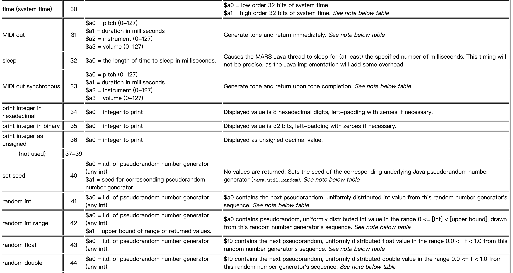

# COMP2611  Computer Organization
## **MIPS** &nbsp; Review Notes

### 1. Data Types

```assembly
# Data segment
.data
h: .word 1 2 3 4	# h is an array of size 4, each element is a word (32 bit)
s: .word 3:5  # s is an array of size 5, each element equals to 3. s[]={3,3,3,3,3}
fourbytes: .ascii "12AB"  # .ascii: string without null terminator
message: .asciiz "\nHello World!\n"  # .asciiz: String with terminator


# Program begins
.text
.globl __start
__start:
```


### 2. Arithmetic Operations

```assembly
add		$a, $b, $c		# $a = $b + $c
sub		$a, $b, $c		# $a = $b - $c
addi	$a, $b, 2			# $a = $b + 2
addi	$a, $b, -2		# $a = $b - 2

sll $a$, $b$, 2  	# a = b << 2 = b * 4
srl $a$, $b$, 2  	# a = b >> 2 = b // 4
sra $a$, $b$, 2  	# shift right arithmetic, sign extension
```

### 3. Logic Operations
```assembly
addi $s0, $0, 0xffff0000
addi $s1, $0, 0xaaaa1111
not $t0, $s0
and $t1, $s0, $s1
or $t2, $s0, $s1
nor $t3, $s0, $s1
xor $t4, $s0, $s1

# Expected Result:
# $t0 = 0x0000ffff
# $t1 = 0xaaaa0000
# $t2 = 0xffff1111
# $t3 = 0x0000eeee
# $t4 = 0x55551111
```

### 4. Data Transfer
```assembly
.data
fourbytes: .ascii "12AB"
fourwords: .word 1 -1 1024 -65536

.text
.globl _main
_main:
la $s0, fourbytes  	# load address
lb $t0, 0($s0)  		# load_byte, $t0 = '1' = 49
lb $t1, 2($s0) 			# $t1 = 'A' = 65
lb $t2, 1($s0)  		# $t2 = '2' = 50
lb $t3, 4($s0)  		# out of range, $t3 = '1' = 1

la $s1, fourwords		
lw $t0, 0($s1)  		# $t0 = 1 = 0x00000001
lw $t1, 4($s1)  		# $t1 = -1 = 0xffffffff
lw $t2, 8($s1)  		# $t0 = 1024 = 0x00000400
lw $t3, 12($s1)  		# $t1 = -65536 = 0xffff0000


# Data transfer
# Big-endian: the end of a word matches a bigger address
sw		$t0, 100($s0)	# Memory[$s0 + 100] = $t0; store word from reg to mem
sb		$t0, 100($s0)	# store rightmost byte in $t0
```

### 5. Control Flow

```assembly
# if-else statement
# if($s3 == $s4) If...
# else if($s3 == $s1) ElseIf...
# else Else...
# Exit...
	beq $s3, $s4, If
	beq $s3, $s1, ElseIf
	j Else
If: add $s0, $s1, $s2
	j exit
ElseIf: sub $s0, $s1, $s2
	j exit
Else: add $s0, $s1, $s4
	exit:
	
# Comparison:
# Refer to midterm-quick-reference

# while loop
Loop: bne $t0, $s2, Exit	 # go to Exit if $t0 != $s2
	# ...
	addi $s1, $s1, 1		# $s1 = $s1 + 1
	j Loop
Exit:


# Branch comparison with zero
bgez $s, label	# if ($s >= 0)
bgtz $s, label	# if ($s > 0)
blez $s, label	# if ($s <= 0)
bltz $s, label	# if ($s < 0)
```

### 6. System Call


```assembly
# Example of a+b problem:
.data
.text
.globl _main
_main:
li $v0, 5  # syscall code 5: read integer
syscall
add $t0, $zero, $v0

li $v0, 5  
syscall
add $t1, $zero, $v0

add $a0, $t0, $t1  # put sum into $a0, which is syscall's parameter

li $v0, 1  # syscall code 1: print integer
syscall

# don't forget to exit
li $v0, 10
syscall
```

Some Syscall related to random: (**30, 40, 42**)



```assembly
# Example: Generate random int with syscall
.data
.text
.globl _main
_main:
li $v0, 30  # get system time
syscall

add $a1, $0, $a0  # put time to random seed
li $a0, 0  # use #0 generator
li $v0, 40
syscall

li $a0, 0
li $a1, 20  # generate [1,20], set upper bound = 20
li $v0, 42
syscall

addi $a0, $a0, 1  # [0,19] -> [1,20]

li $v0, 1  # print integer
syscall
```

### 7. Procedure

```assembly
To be finished
```